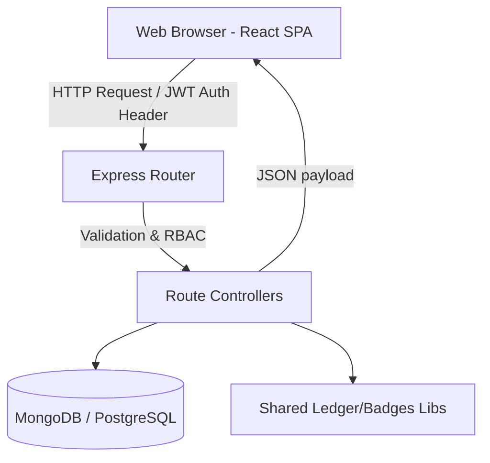
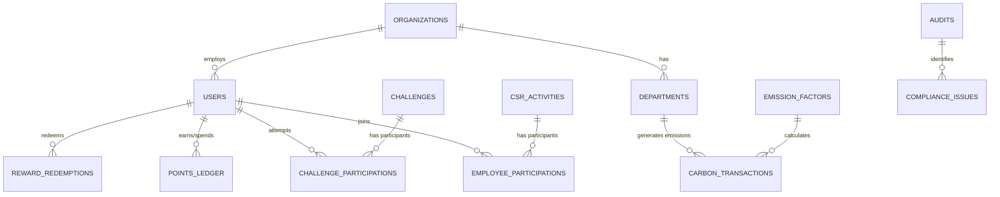

# EcoSphere

> Enterprise ESG Management, Simplified.

---

## 2. Project Overview

EcoSphere is a comprehensive B2B SaaS platform that enables organizations to manage their Environmental, Social, and Governance (ESG) metrics from a single pane of glass. It is designed to track carbon emissions, manage Corporate Social Responsibility (CSR) initiatives, engage employees through gamification, handle compliance audits, and generate investor-ready reports.

## 3. Problem Statement

Organizations struggle to consolidate fragmented ESG data, track their carbon footprints accurately, ensure compliance with evolving governance standards, and actively engage employees in their sustainability initiatives.

## 4. Solution

EcoSphere solves this by providing a unified, multi-tenant platform featuring an automated carbon emission calculation engine, an engaging gamification system (XP, Badges, Leaderboards) to drive employee participation in CSR, robust governance audit tracking, and automated ESG report generation.

## 5. Key Features

- **Environmental Tracking**: Log carbon transactions with automated CO2e coefficient calculations across travel, energy, and waste. Monitor organizational environmental goals.
- **Social & CSR Management**: Centralized hub for employees to join CSR activities (e.g. tree planting) with a secure management approval workflow.
- **Gamification Engine**: Award XP and points for completed challenges. Unlock dynamic badges and redeem points for rewards.
- **Governance & Compliance**: Manage internal audits, track compliance issues with severity levels, and enforce policy acknowledgements.
- **Automated Reporting**: Custom builder to generate and download comprehensive ESG insights in PDF/Excel formats.

## 6. Tech Stack

| Layer              | Technology                                                       |
| ------------------ | ---------------------------------------------------------------- |
| **Frontend**       | React 18, TypeScript, Tailwind CSS v4, Vite, Lucide React        |
| **Backend**        | Node.js, Express.js                                              |
| **Database**       | PostgreSQL (Multi-tenant schema) & MongoDB (Transaction Ledgers) |
| **Authentication** | JWT (JSON Web Tokens) via HTTP-only Cookies                      |
| **Architecture**   | RESTful APIs, Role-Based Access Control (RBAC)                   |

## 7. System Architecture



## 8. Project Structure

```text
/
├── frontend/                  # React SPA
│   └── ecosphere-frontend/
│       ├── src/               # UI Components, Pages, Mock Data, Types
│       ├── package.json
│       └── tailwind.config.js
├── backend/                   # Node.js API
│   ├── config/                # Server & DB configs
│   ├── routes/                # Express routes (auth, dashboard, gamification)
│   ├── shared/                # Middleware (auth, RBAC)
│   ├── lib/                   # Business logic (badges, points-ledger)
│   └── app.js
└── database/                  # SQL Schemas
    ├── schema.sql             # Full PostgreSQL schema definition
    ├── seed.sql
    ├── views.sql
    ├── queries.sql
    └── reset.sql
```

## 9. Database Design Summary

The application employs a robust multi-tenant design logically separating data via `org_id`.



## 10. Application Workflow

1. **Onboarding**: Users land on the platform and sign up/log in through the Authentication Gateway.
2. **Dashboard Overview**: Users are presented with aggregated high-level ESG performance metrics and upcoming deadlines.
3. **Engagement**: Employees explore the Gamification and Social tabs to join challenges and CSR activities.
4. **Approval & Ledger Update**: Managers review proof URLs and approve participations. The backend executes a secure transaction to update the user's Points and XP ledger.
5. **Reporting**: Admins generate PDF/Excel reports of the aggregated ESG data for external stakeholders.

## 11. User Roles

- **Employee**: Can view logs, join challenges, participate in CSR activities, request rewards, and acknowledge policies.
- **Manager**: Can log carbon data, manage audits, log compliance issues, and review/approve employee CSR participations.
- **Admin**: Has full access, including managing badges, rewards, and global system settings.

## 12. Screenshots


_Caption: EcoSphere Executive Dashboard displaying ESG metrics and carbon trends._


_Caption: Employee view of active challenges, leaderboard, and badge gallery._


_Caption: Carbon transaction logs and environmental goal tracking._

## 13. API Overview

All API requests (aside from auth) require a valid JWT token.

- `POST /api/auth/login` - Authenticate users
- `GET /api/dashboard/summary` - Retrieve high-level ESG metrics
- `POST /api/environmental/calculate` - Automatically compute CO2e and log transactions
- `POST /api/social/participations/:id/approve` - Approve employee CSR participation (Manager/Admin)
- `POST /api/gamification/challenges/:id/complete` - Mark challenge as completed to earn XP
- `POST /api/reports/generate` - Generate PDF/Excel reports

## 14. Installation & Setup

**Prerequisites:** Node.js (v18+), PostgreSQL, MongoDB.

**Frontend:**

```bash
cd frontend/ecosphere-frontend
npm install
npm run dev
```

**Backend:**

```bash
cd backend
npm install
npm run start
```

**Database (PostgreSQL):**
Execute `database/schema.sql` on your local PostgreSQL instance to scaffold the tables.

## 15. Environment Variables

Create a `.env` file in the `backend` directory:

```env
PORT=3001
MONGODB_URI=mongodb://localhost:27017/ecosphere
JWT_SECRET=super_secret_jwt_sign_key
NODE_ENV=development
```

## 16. Running the Project

1. Start the PostgreSQL server and MongoDB service.
2. Start the Backend API: `npm run start` (Runs on `localhost:3001`).
3. Start the Frontend Vite server: `npm run dev` (Runs on `localhost:5173`).
4. Access the web app in your browser at `http://localhost:5173`.

## 17. Future Scope

- **IoT Integration**: Direct ingestion of building energy metrics via IoT sensors.
- **HRIS Sync**: Seamless integration with Workday/BambooHR to sync organizational structures and employee profiles automatically.
- **Advanced Predictive Analytics**: AI-driven carbon trend forecasting.

## 18. Team Members

- Atharva Ketkar
- Atharva Khandagale
- Vibha Madabushi
  -Dwithi Poojary

## 19. License

To be Added

## 20. Acknowledgements

- Icons by [Lucide](https://lucide.dev/)
- Built with [React](https://reactjs.org/) and [Tailwind CSS](https://tailwindcss.com/)
